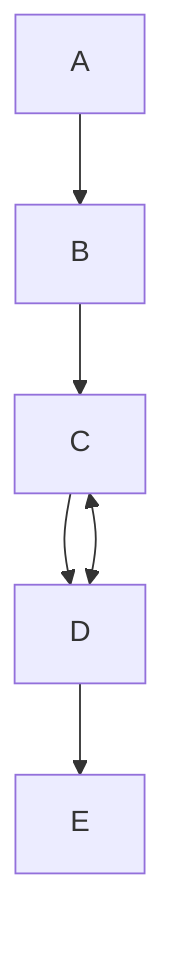

# Optimizing Power Package Reliability: Mitigating Thermal Expansion Failures Using Active Learning


[](https://docs.pyansys.com/)
[](https://pypi.org/project/ansys-dpf-core/)
[](https://pypi.org/project/ansys-dpf-core)

## Authors

- [Dharshan Barkur](https://github.com/dhabar95) - PhD Student (Robert Bosch GmbH, Kusterdingen - Technische Universität Dresden)
- [Akshay Vivek Panchwagh](https://github.com/) - PhD Student (Robert Bosch GmbH - Technische Universität Chemnitz)

## Overview
### About the repository
This repository contains the codebase for the multi-objective optimization (MOO) of a Power Module, leveraging [pyMAPDL](https://github.com/ansys/pymapdl), [pyDPF](https://github.com/ansys/pydpf-core), and [Ax](https://github.com/facebook/Ax). The project is developed as part of the ECTC Student Competition 2025, focusing on simulation-driven optimization for enhanced performance and reliability. The authors are keeping this repository open to promote scientific sharing, encourage reproducibility, and contribute to the collective advancement of simulation-driven optimization methods in electronic packaging.

### Motivation for this project
Power electronic packages—such as discrete packages, power modules, and ASICs—are composed of heterogeneous materials like copper, epoxy polymers, and SAC solder. Each of these materials exhibits unique thermo-mechanical behavior due to their intrinsic material properties. Among these, the Coefficient of Thermal Expansion (CTE) plays a critical role. When subjected to temperature fluctuations, the mismatch in CTEs among different materials leads to thermo-mechanical stresses, ultimately causing structural reliability issues and premature failure.
To tackle this challenge, this project proposes a novel simulation-driven design methodology that integrates high-fidelity finite element modeling (FEM) via pyMAPDL scripting with Bayesian Optimization using Gaussian Processes (BO-GP) through Facebook's Ax platform. By adaptively exploring the design space and accounting for uncertainties, this approach enables efficient identification of failure-prone configurations and optimization of both material selection and package geometry. The result is a robust, computationally efficient framework that enhances the reliability and performance of power packages under complex thermal loading conditions.

### Getting started
To use the code in the repo effectively, one can add the above "environment.yaml" file as their preferred environment in Anaconda or can follow the below steps to install [pyMAPDL](https://github.com/ansys/pymapdl), [pyDPF](https://github.com/ansys/pydpf-core), and [Ax](https://github.com/facebook/Ax):
Install the latest release from PyPi with:

```bash
pip install ansys-mapdl-core
```
To verify the successful installation:

```bash
from ansys.mapdl.core import launch_mapdl
mapdl = launch_mapdl()
print(mapdl)
```
To visualize using Visualization Toolkit (VTK):

```bash
pip install vtk
```
### pyDPF

To install PyDPF-Core, in a Python environment, run this command:
```bash
pip install ansys-dpf-core
```
To verify the installation, run the example:
```bash
from ansys.dpf import core as dpf
from ansys.dpf.core import examples
model = dpf.Model(examples.download_crankshaft())
print(model)
```
### Ax
Install Ax:
```bash
conda install pytorch torchvision -c pytorch  # OSX only
```
```bash
pip3 install ax-platform  # all systems
```
Here is a simple flow chart:


